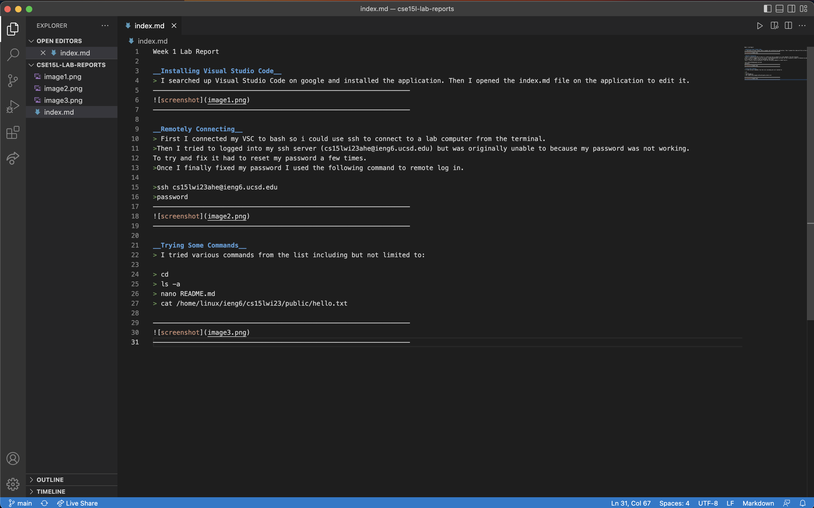
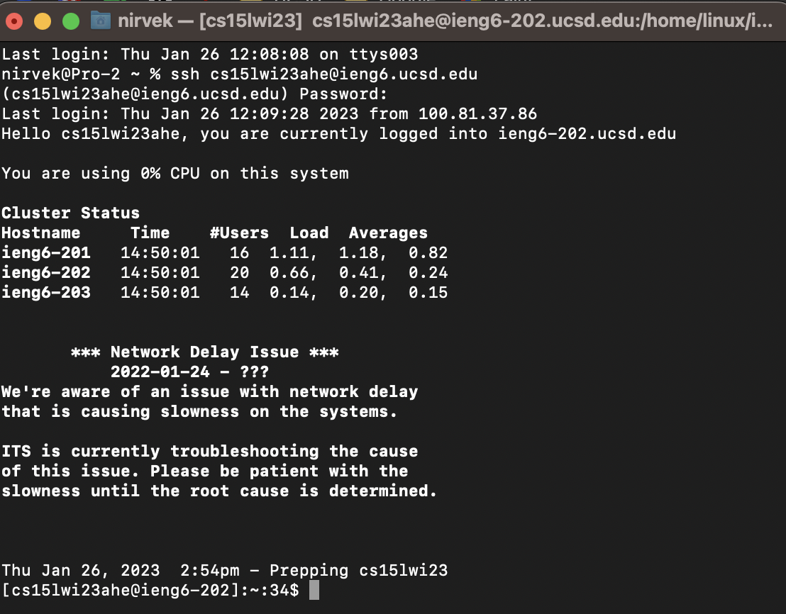

Week 1 Lab Report

__Installing Visual Studio Code__
> I searched up Visual Studio Code on google and installed the application. Then I opened the index.md file on the application to edit it.
——————————————————————————————————————————————————————————————————

——————————————————————————————————————————————————————————————————

__Remotely Connecting__ 
> First I connected my VSC to bash so i could use ssh to connect to a lab computer from the terminal. 
>Then I tried to logged into my ssh server (cs15lwi23ahe@ieng6.ucsd.edu) but was originally unable to because my password was not working. 
To try and fix it had to reset my password a few times. 
>Once I finally fixed my password I used the following command to remote log in.

>ssh cs15lwi23ahe@ieng6.ucsd.edu
>password
——————————————————————————————————————————————————————————————————

——————————————————————————————————————————————————————————————————

__Trying Some Commands__
> I tried various commands from the list including but not limited to: 

> cd
> ls -a
> nano README.md
> cat /home/linux/ieng6/cs15lwi23/public/hello.txt

——————————————————————————————————————————————————————————————————

——————————————————————————————————————————————————————————————————